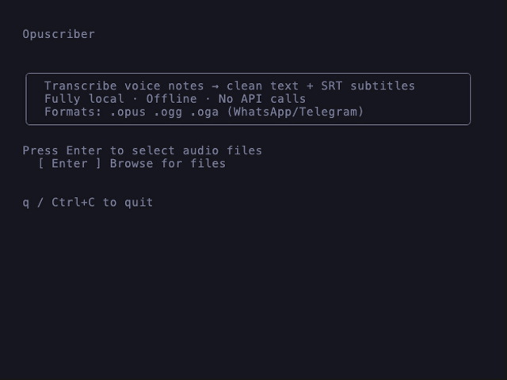

# Opuscriber — Offline Speech-to-Text for Opus Audio

> Local audio transcription and SRT subtitle generation powered by Whisper.
> Single binary. Cross-platform (macOS, Linux). No cloud. No telemetry. No ffmpeg.

Opuscriber transcribes Opus-encoded audio files (.opus, .ogg, .oga) into clean
plain-text transcripts and DaVinci-Resolve-ready SRT subtitles. Runs entirely on
your machine — download a Whisper model once, then transcribe forever offline.

Built for WhatsApp and Telegram voice notes, works with any Opus audio.

<picture>
  <source media="(prefers-color-scheme: dark)" srcset="demo.gif">
  
</picture>

## Quickstart

```bash
# Clone and build (requires Go 1.27+, cmake, and a C compiler)
git clone https://github.com/primedx/opuscriber.git
cd opuscriber
make build

# Download a Whisper model
./opuscriber model install medium

# Transcribe all audio files
./opuscriber --input ./in --output ./out
```

That's it. No Docker, no ffmpeg, no Python, no cloud setup.

## What Is Opuscriber?

Opuscriber turns spoken-word Opus audio into two files: a clean plain-text transcript and a timestamped SRT subtitle file importable directly into DaVinci Resolve, VLC, or any editor that supports SRT.

It's purpose-built for **offline use** — once you download a Whisper model, you
never need the internet again. Perfect for journalists processing field recordings,
legal transcription, podcasters generating subtitles, or anyone who doesn't want
their voice notes uploaded to a cloud API.

## Why Opuscriber?

**Instead of using whisper.cpp directly** — you need ffmpeg to convert Opus to
WAV, manual shell scripts to generate SRT, and you re-process files you already
transcribed. Opuscriber handles all of this in a single command: pure-Go Opus
decode, built-in SRT generation, and idempotent resume.

**Instead of a cloud speech-to-text API** — you pay per minute, you need internet,
and your audio leaves your machine. Opuscriber is fully local. Download a model
once and transcribe forever with no network. Your data stays on your machine.

**Instead of a desktop GUI app** — you get a polished interface but lose
automation. Opuscriber works as both a terminal UI for interactive use *and* a
headless CLI for scripts, cron jobs, and pipelines.

## Features

- **Single binary**: No Docker, no Python, no shell wrappers — one static binary
- **No ffmpeg required**: Pure Go OGG/Opus decode in-process — no external audio tooling
- **Whisper inference**: whisper.cpp linked directly via CGo — GPU-accelerated on Metal (macOS) and CUDA (Linux), with CPU fallback
- **Two modes**: Non-interactive CLI (pipeline-safe) and interactive Bubble Tea TUI
- **Idempotent**: Skips files that already have both `.txt` and `.srt` outputs
- **Text reflow**: Joins Whisper segment lines into clean paragraphs
- **SRT subtitles**: Standard format, imports into DaVinci Resolve, VLC, Premiere
- **Language auto-detect**: Detects the spoken language from the audio
- **Model integrity**: All downloads sha256-verified against an embedded catalog
- **Model management**: Download, list, remove models — no manual file wrangling
- **Cross-platform**: macOS (Apple Silicon + Intel via Metal), Linux (CUDA + CPU)

## Which Model Should I Use?

Models range from tiny (fast, okay accuracy) to v3-large (slow, near-perfect).
Disk sizes are exact; RAM is approximate.

| Model | Disk | RAM (approx) | Speed | Best For |
|---|---|---|---|---|
| `tiny` | 74 MB | ~300 MB | Fastest | Quick tests, low-resource devices |
| `base` | 141 MB | ~500 MB | Fast | Short clips, casual use |
| `small` | 465 MB | ~1 GB | Moderate | Good balance for most users |
| `medium` ★ | 1.4 GB | ~2 GB | Slower | Excellent accuracy for most use |
| `large-v3` | 2.9 GB | ~4 GB | Slowest | Highest accuracy, long recordings |
| `large-v3-turbo` | 1.5 GB | ~3 GB | Faster | Near-large accuracy, much faster |

★ = recommended default. Start with `medium`. Switch to `large-v3-turbo` for
near-perfect transcription, or `small` for a speed boost on older machines.

```bash
opuscriber model install large-v3-turbo
```

## Usage

### Commands

```
opuscriber [flags]                    Transcribe audio files
opuscriber model list                 List available Whisper models
opuscriber model install <model>      Download and install a model
opuscriber model installed            Show installed models
opuscriber model remove <model>       Remove a model
opuscriber config show                Show current configuration
opuscriber config set <key> <value>   Change a config value
opuscriber tui                        Launch interactive TUI
```

### Flags

| Flag | Default | Description |
|---|---|---|
| `-l, --lang` | `auto` | Language code (ISO 639-1) |
| `-m, --model` | `medium` | Model size: tiny, base, small, medium, large-v3, large-v3-turbo |
| `--input` | `./in` | Input audio directory |
| `--output` | `./out` | Output directory for `.txt` and `.srt` |
| `--models` | `~/.config/opuscriber/models` | Model storage directory |
| `-i, --interactive` | | Launch interactive TUI |

### Interactive TUI

```bash
opuscriber --interactive
# or
opuscriber tui
```

The TUI lets you browse and select audio files, track transcription progress
with a progress bar and live per-file checkmarks, then view results.

## Installation

### Build from source (recommended)

```bash
git clone https://github.com/primedx/opuscriber.git
cd opuscriber
make build
```

**Prerequisites**: Go 1.27+, cmake, and a C compiler (Clang on macOS, GCC on Linux).

The build clones whisper.cpp at a pinned version, compiles the static library
via CMake, and links it into the binary via CGo. First build takes ~2 minutes;
subsequent builds recompile only the Go layer.

### Homebrew (coming soon)

```bash
brew install primedx/tap/opuscriber
```

### Prebuilt binaries (coming soon)

Platform-specific binaries will be attached to [GitHub Releases](https://github.com/primedx/opuscriber/releases).

## Pipeline

```
.opus/.ogg/.oga
     │
     ▼
  OGG/Opus decode ──→ 16kHz mono PCM
     │
     ▼
  Whisper model ──→ timestamped text segments
     │
     ├──→ TXT: reflowed paragraphs
     └──→ SRT: subtitle file
```

See [docs/ARCHITECTURE.md](docs/ARCHITECTURE.md) for the full build chain, CGo
interop, GPU backends, and project structure.

## Configuration

Configuration is stored in `~/.config/opuscriber/config.json`:

```json
{
  "version": 1,
  "default_model": "medium"
}
```

Override the config path with `OPUSCRIBER_CONFIG`. Override the model storage
directory with `OPUSCRIBER_MODELS` or the `--models` flag.

## Documentation

- [Architecture](docs/ARCHITECTURE.md) — build chain, CGo interop, GPU backends, project structure
- [Contributing](docs/CONTRIBUTING.md) — setup, building, testing, project layout
- [Maintaining](docs/MAINTAINING.md) — release process, whisper.cpp version bumps

## License

MIT